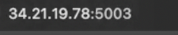

# cloud_vm_networking_flask
HHA 504 assignment 2

## Student Info
- Name:  Amy Kim
- Cloud Provider: Google Cloud Platform (GCP)

## Video recording: 
- Zoom Recording: https://youtu.be/cZs24nV_ijs

## Steps
### 1. VM Creation
#### Create a VM through GCP - I made the smallest/cheapest version by selecting Ubuntu image and E2 micro


### 2. Networking (Port 5003 Open)
#### After VM is created, go into the settings and open up the 5003 port, as shown as in the video tutorial.


### 3. OS Update + Python Install
#### Enter these commands into the SSH before running the flask app.
```
sudo apt-get update
```
```
sudo apt install python3 python3-pip git -y
```


### 4. Flask App Running
#### After everything is installed on the VM, you should be able to cd into the repository and run the app.py


### 5. Public IP Access
#### This public IP address only works if the SSH is up and running
URL: http://34.21.19.78:5003  


#### I stopped off my VM after completing the tutorial, therefore, you will not be able to see it if you click on the URL. 